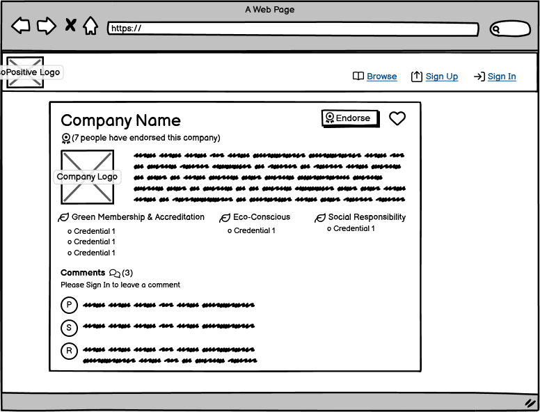
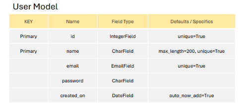
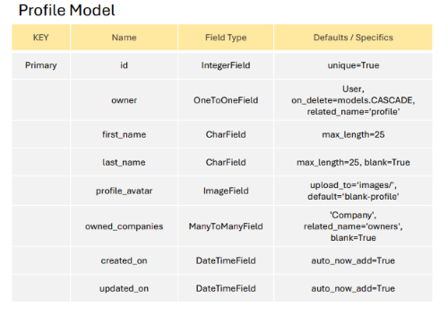
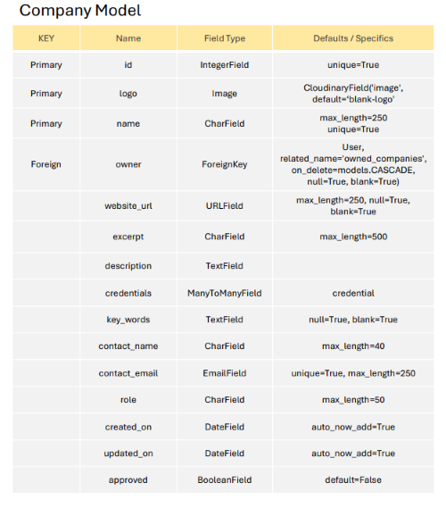
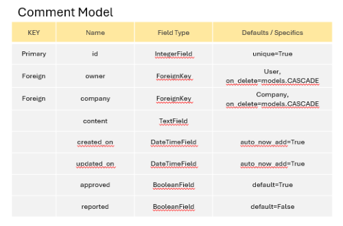
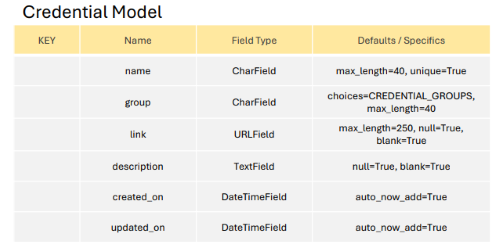
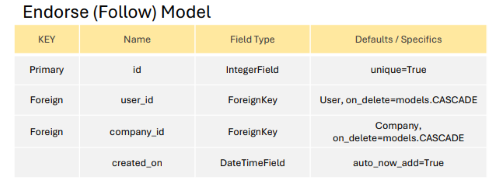
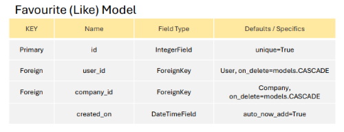

# EcoPositive Bristol (Django REST API)

[EcoPositive Bristol](https://tastesensation-pp4-54d01fbc1628.herokuapp.com/) is a one stop directory championing Bristol’s eco-conscious and socially responsible businesses.

Users are invited to sign up to endorse the companies that they support and comment on listed businesses so that other visitors to the site can see which businesses are popular.

### Design Process

***Wireframes***

- Initial Wireframe designs were used to plan out the layout for the Company List and Company Detail pages

***Models***

- The next step was to plan and devise an ERD for each of my database models and a schema to map out and understand the relationships between them. I created an ERD and model schema for the project based on all of the elements that I would like to include if I was able (this included the Should Have and Could Have User Story issues).

- I created an ERD for the following models:
  - User Model (Automatically created in Django framework)
  - Profile Model
  - Company Model
  - Comments Model
  - Credential Model
  - Endorse Model
  - Favourite Model

## Testing

### Automated Testing

Each resource in the API has been tested using the REST built-in APITestCase functionality. Tests are written in a tests.py file within each app directory. 

Each test is manually checked by forcing a controlled fail by using an incorrect status code and ensuring that this is the only reason the test fails. The status code is then updated and the test run again to ensure it passes with the expected status code.  

***Companies***

- **CompanyListViewTests**
  - test_can_list_companies
  - test_logged_in_user_can_create_company
  - test_user_not_logged_in_cant_create_company

- **CompanyDetailViewTests**
  - test_can_retrieve_company_using_valid_id
  - test_cant_retrieve_company_using_invalid_id
  - test_user_can_update_own_company
  - test_user_cant_update_another_users_company

***Comments***

- **CommentListViewTests**
  - test_can_list_all_comments
  - test_logged_in_user_can_create_comment
  - test_user_not_logged_in_cant_create_comment

- **CommentDetailViewTests**
  - test_can_retrieve_comment_using_valid_id
  - test_cant_retrieve_comment_using_invalid_id
  - test_user_can_update_own_comment
  - test_user_cant_update_another_users_comment